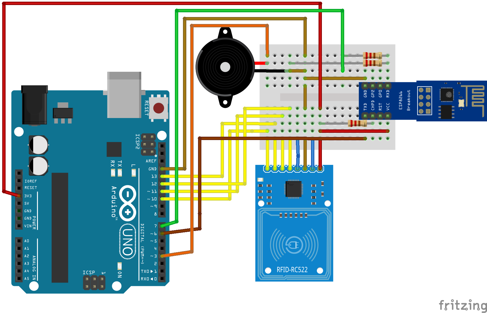

## Dispositivo e Comunicação

### Responsáveis:
  * Arley, Majid, Luiza e Gabriel (Auxiliar)
----------------------------------------------------------
<h1>Dispositivo RFID</h1>

O dispositivo monitora quem está no ambiente, para ter o controle de quantas pessoas estão no local e em qual setor. Todo este aparato é para garantir a segurança caso venha ocorrer alguma coisa que coloque a vida de qualquer usuário em risco. Todo o sistema foi projetado para garantir a segurança de todos dentro da organização, o monitoramento em tempo real faz com que qualquer providência tomada seja ágil e eficaz.

O dispositivo está conectado à rede para que toda essa informação seja mais eficaz, para que não seja perdida, está armazenando em uma base de dados onde é atualizado constantemente.

<h2>Projeto</h2>

Para o projeto foi usado os seguintes módulos:

<table align="center">
	<thead>
		<th>Nome</th>
		<th>Dispositivo</th>
	</thead>
	<tbody>
		<tr>
			<td>Controlador de acesso RC522</td>
			<td></td>
		</tr>
		<tr>
			<td>Modulo WIFI ESP8266</td>
			<td></td>
		</tr>
		<tr>
			<td>Resistor de 10k</td>
			<td>
		</tr>
		<tr>
			<td>Resistor de 200ohms</td>
			<td>
		</tr>
		<tr>
			<td>Arduino Uno</td>
			<td>
		</tr>
		<tr>
			<td>Protoboard</td>
			<td>
		</tr>
		<tr>
			<td>Buzzer</td>
			<td> </td>
		</tr>
</table>

Todos este componentes em junção fazem o dispositivo ser eficaz, além de usar uma linguagem de programação poderosa. A IDE utilizada para desenvolver toda parte logica foi o Arduino, utilizando a linguagem de programação Sketch.

<h3>Dispositivo WiFi</h3>
 
Circuito 

  

 
Código principal: rfid-loc-wifi.ino 

<ul>
<li> Código para se comunicar com o servidor hospedado na Raspberry enviando número de identificação do dispositivo.</li>
 </ul>
 
<h3>Atividade do dispositivo</h3>
<ul>
	<li>Conecta-se à rede do local</li>
	<li>Se dectar presença do cartão RFID, faz a leitura de seu ID </li>
	<li>Envia os dados para o módulo ESP8266 pelos comandos AT </li>
	<li>Módulo ESP 8266 envia a informação para um servidor pelo método GET do protocolo HTTP</li>
	
</ul>

O dispositivo está apenas responsável por fazer a leitura do card RFID e repassar para um servidor onde o mesmo estará repassando para a aplicação para o processo de cadastro, caso não esteja no banco de dados, ou fazer a ocorrência do usuário com o cartão caso contrário. O dispositivo vai apenas passar as tags para que seja feito a comparação no banco de dados, logo o servidor retorna com a resposta se está ou não cadastrado.

<h3>Atualização do firmware ESP8266</h3>

 Para que o módulo WiFi utilizado pudesse se comunicar de forma adequada com o Arduino por meio de comandos AT, é preciso fazer a atualização de seu firmware, pois não necessáriamente o mesmo já está apto de fábrica a ter esse tipo de comunicação com o arduino e pode-se evitar possíveis erros, deixando-o assim mais estável. Desta forma, foi utilizado um Adaptador Conversor USB Serial TTL para transmitir a atualização. Os detalhes podem ser encontrados nos links auxiliares.

<h3>Links Auxiliares</h3>
 
 Upgrade de firmware ESP8266 - ESP01 

 <ul>
	
<li><a href="https://blogmasterwalkershop.com.br/embarcados/esp8266/upgrade-de-firmware-do-wifi-esp8266-esp-01-atraves-do-arduino-e-conversor-usb-serial/">Ler sobre atualização de firmware do WiFi ESP 8266 ESP 01</a> </li>
 </ul>
 
 Lista de comandos AT 

  <ul>
	<li><a href="http://room-15.github.io/blog/2015/03/26/esp8266-at-command-reference">Ler sobre comandos AT</a> </li>
 </ul>
