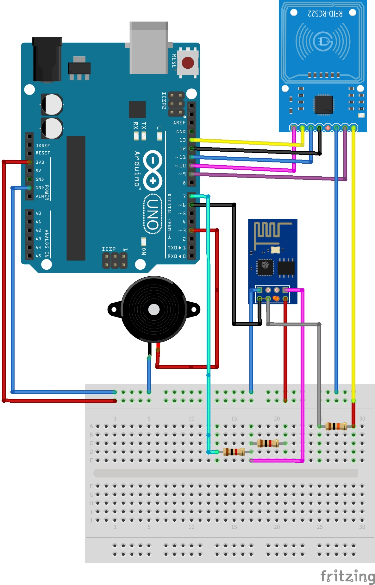

## Dispositivo e Comunicação

### Responsáveis:
  * Arley, Majid e Gabriel (Auxiliar)
----------------------------------------------------------
<h1>Dispositivo RFID</h1>

O dispositivo monitora quem está no ambiente, para ter o controle de quantas pessoas estão no local e em qual setor. Todo este aparato é para garantir a segurança caso venha ocorrer alguma coisa que coloque a vida de qualquer usuário em risco. Todo o sistema foi projetado para garantir a segurança de todos dentro da organização, o monitoramento em tempo real faz com que qualquer providência tomada seja ágil e eficaz.

O dispositivo está conectado à rede para que toda essa informação seja mais eficaz, para que não seja perdida, está armazenando em uma base de dados onde é atualizado constantemente.

<h2>Projeto</h2>

Para o projeto foi usado os seguintes módulos:

<table>
	<thead>
		<th>Nome</th>
		<th>Dispositivo</th>
	</thead>
	<tbody>
		<tr>
			<td>Controlador de acesso RC522</td>
			<td></td>
		</tr>
		<tr>
			<td>Modulo WIFI ESP8266</td>
			<td></td>
		</tr>
		<tr>
			<td>Resistor de 10k</td>
			<td>
		</tr>
		<tr>
			<td>Resistor de 200ohms</td>
			<td>
		</tr>
		<tr>
			<td>Led vermelho</td>
			<td>
		</tr>
		<tr>
			<td>Led verde</td>
			<td>
		</tr>
		<tr>
			<td>Arduino Uno</td>
			<td>
		</tr>
		<tr>
			<td>Protoboard</td>
			<td>
		</tr>
		<tr>
			<td>Buzzer</td>
			<td> </td>
		</tr>
</table>

Todos este componentes em junção fazem o dispositivo ser eficaz, além de usar uma linguagem de programação poderosa. A IDE utilizada para desenvolver toda parte logica foi o Arduino, utilizando a linguagem de programação Sketch.

<h3>Circuito Dispositivo WiFi</h3>

  

<h3>Atividade do dispositivo</h3>
<ul>
	<li>Faz a leitura de um card RFID </li>
	<li>Envia a informação para um servidor</li>
	<li>Aponta se está cadastrado ou não com led vermelho/verde</li>
	<li>Conectado à rede do local</li>
</ul>

O dispositivo está apenas responsável por fazer a leitura do card RFID e repassar para um servidor onde o mesmo vai estar fazendo todo o processo de cadastro e conferencia, enquanto o dispositivo vai apenas passar as tags para que seja feito a comparação no banco de dados, logo o servidor retorna com a resposta se está ou não cadastrado.

