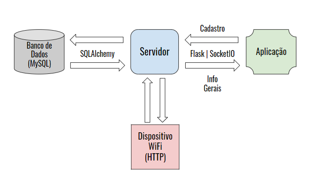

## Servidor
---------------------------------
### Responsáveis
* Gabriel, Renato e Saulo

---------------------------------
### Visão geral

 
  O servidor recebe dados dos dispositivos RFID e da aplicação, bem como envia dados em forma de JSON's para os mesmos e provém a comunicação entre estes e o banco de dados. Algumas páginas, como o registro, atualização e dashboard, usam eventos socket para que a comunicação com a aplicação seja ininterrupta e atualize assim que ocorrer qualquer disparo de sinal de qualquer dispositivo, transmitindo a informação o mais rápido possível. Para os casos comuns são esperados comunicações por meio de métodos HTTP. Além disso, o servidor é capaz de se comunicar com os dispositivos independentemente da conexão com a aplicação.

  
---------------------------------
### Requisitos Técnicos e escolhas

 

  Tínhamos como requisitos técnicos um servidor que poderia ter uma resposta rápida às requisições da aplicação. Além de ser capaz de se comunicar ao mesmo tempo a aplicação e os dispositivos WiFi. Pensou-se então em um método em comum a ser utilizado por ambas as partes, estes seriam os métodos HTTP. Partindo da premissa de utilizar a linguagem Python e tendo isso em vista, procurou-se frameworks para se trabalhar para o desenvolvimento de servidores. O "flask" se mostrou ser simples e eficaz, além de ter uma comunidade muito ativa, o que ajuda muito no desenvolvimento. Muitas das bibliotecas utilizadas são consideradas extensões para o "flask", para que não ocorra um conflito dos arquivos. Para que os dados da aplicação estejam atualizados a todo momento com os contidos no banco de dados, utilizou-se a biblioteca "flask-socketio". Esta biblioteca foi escolhida por ter uma documentação muito bem detalhada, ser uma extensão para o "flask" e ter uma comunidade ativa nos fóruns e relacionados.
  
  Para a comunicação com o banco de dados era necessário que se tivesse uma forma prática e que se pudesse automatizar algumas pesquisas, atualizações e inserções no banco, pois será necessário várias consultas em vários momentos. Uma solução encontrada foi o uso da biblioteca "flask-SQLAlchemy" que, novamente, é uma extensão para o "flask" que utiliza o SQLAlchemy, uma ferramenta muito poderosa para o uso de SQL no Python mapeando o banco de dados no servidor e a partir disso, utilizar de suas funções e métodos para se ter uma alta performance nas consultas no banco de dados.
  

  
---------------------------------
### Pontes de comunicação
 * Aplicação
   * Flask
     * Flask-CORS
     * Flask-SocketIO
 * Dispositivo WiFi
   * Protocolo HTTP
 * Banco de dados
   * MySQL
   * Flask-SQLAlchemy

  

  Diagrama funcional
  

---------------------------------
### Arquivos desenvolvidos
 * serverRFID_V2_Socket.py
   * Servidor em si com as rotas de comunicação com o dispositivo e aplicação. Utiliza o SQLAlchemy para se comunicar com o banco de dados, contém o mapeamento do banco, faz comunicação via socket.io com a aplicação e comunicação com os dispositivos via rotas Flask. 
 * db_commands_v2.py
   * Biblioteca contendo todos os comandos do SQLAlchemy utilizados para a comunicação com o banco de dados.

---------------------------------
### Problemas encontrados
 * Nos primeiros testes ao se comunicar com a aplicação, o servidor não recebia o método HTTP esperado, ou seja, GET ou POST. Sempre era recebido da aplicação o método OPTIONS. Depois de pesquisar sobre o problema, percebeu-se que se tratava do uso de um mecanismo chamado "Cross-Origin Resource Sharing"(CORS) o qual adiciona um cabeçalho HTTP que diz para os navegadores dar para uma aplicação web rodando em uma origem, acesso para selecionar recursos de diferentes origens. A grosso modo, a aplicação envia para o servidor primeiramente uma requisição solicitando quais os métodos que o servidor suporta naquela rota, para então, depois da aprovação do servidor, envia o requisição de verdade. Desta forma, utilizou-se da biblioteca "flask_cors" que trás este mecanismo para o flask.
 * Ao passar o servidor para a Raspberry, onde seria hospedado por definitivo, erros foram encontrados, podendo ser causados pelo processamento da Raspberry. Um destes erros é a queda do servidor quando recebia muitas requisições ao mesmo tempo. Isto ocorria pelo fato da aplicação estar enviando requisições automáticas a cada segundo, que se chocavam com outras requisições. Isto foi feito com o intuito de sempre estar com os dados atualizados na página web sem a necessidade de atualizar a página. Este problema foi resolvido ao se implementar a comunicação via socket.io para as páginas em que era necessário os dados sempre atualizados, abrindo uma ponte de comunicação nos eventos relacionados a esses dados. Isto não apenas deixou de se sobrecarregar o servidor com inúmeras requisições em um curto período, mas também possibilitou a atualização em tempo real da aplicação, o que é ideal para a questão da segurança em monitoramento de usuários.
 * Com o uso do socket.io, o problema do uso do mecanismo CORS voltou a acontecer. Procurando a documentação, teoricamente a biblioteca "flask-socketIO" já trata internamente do uso desse mecanismo, mas não era o que estava acontecendo no nosso caso. A solução para o problema foi inicializar o parâmetro "cors_allowed_origins" de tal forma que qualquer um possa ter acesso aos eventos socket. Para as rotas do servidor segue a mesma solução com o uso da biblioteca "flask-cors".
 * Com o servidor funcionando corretamente na Raspberry, o mesmo não estava preparado para casos em que houver duas entradas em dois dispositivos distintos, colocando o usuário nas duas salas ao mesmo tempo. Para que isso não ocorra, foi implementado uma saída automática da última sala do usuário antes na nova ocorrência, caso o mesmo estivesse com o status de "Entrada".
---------------------------------
### Links auxiliares
 * Mecanismo CORS
   * https://developer.mozilla.org/en-US/docs/Web/HTTP/CORS
 * Download biblioteca flask_cors
   * https://pypi.org/project/Flask-Cors/1.10.3/
 * Documentação flask-socketIO
   * https://flask-socketio.readthedocs.io/en/latest/
 * Documentação flask-SQLAlchemy
   * https://flask-sqlalchemy.palletsprojects.com/en/2.x/
