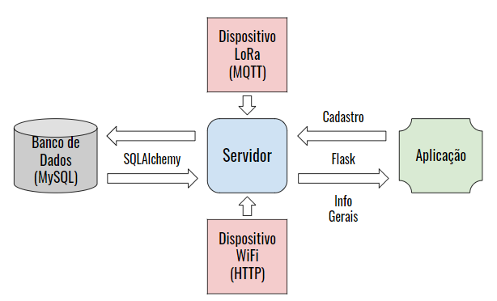

---------------------------------
### Servidor
---------------------------------

  

---------------------------------
### Responsáveis:
---------------------------------
  * Saulo, Gabriel e Renato (Auxiliar)

---------------------------------
### Pontes de comunicação
---------------------------------
 * Aplicação e Dispositivo WiFi
   * Flask
     * Flask_cors
     * Flask_ngrok
   * Métodos HTTP
 * Banco de dados
   * MySQL
   * SQLAlchemy
 * Dispositivo LoRa 
   * The Things Network (ttn)
     * Protocolo MTQQ
---------------------------------
### Arquivos desenvolvidos
---------------------------------
 * serverRFID_sessionRefr.py
   * Servidor em si com as rotas de comunicação com o dispositivo e aplicação. Utilizando o SQLAlchemy para se comunicar com o banco de dados já mapeado. Código inclui rotina para lidar com o fechamento de sessões.
 * db_commands.py
   * Biblioteca contendo todos os comandos do SQLAlchemy utilizados para a comunicação com o banco de dados.
 * db_control.py
   * Realizar o controle da comunicação com banco de dados MySql usando o orm SQLAlchemy. Código inclui rotina para lidar com o fechamento de sessões.
 * db_mapped_objects.py
   * Descrição das tabelas do banco de dados que será trabalhado para usar o orm SQLAlchemy.
 * db_mapped_aux_objects.py
   * Descrição das tabelas auxiliares de nomes que serão utilizados para alimentar o banco com exemplos.
 * behaviors.py
   * Descrição dos tipos de comportamento de cada usuário de teste para alimentação do banco com exemplos.
 * insere_dados_teste.py
   * Organiza de forma aleatória o número determinado de nome de pessoas e seus comportamentos, relaciona a cada uma delas um número de cartão único e gera ocorrência para o número determinado de dias.
 * testedictsetor.py
   * Arquivo de teste para o dicionário de informações do setor a ser enviado para a aplicação.
 * testeimagem.py
   * Arquivo de teste para imagem a ser enviada para a aplicação e armazenada no servidor.
 * rfid.sql
   * Código em SQL do banco de dados princpal com as tabelas de cadastro, cadastro_cartao, cartao, dispositivo e ocorrencia

---------------------------------
### Problemas encontrados
---------------------------------
 * Nos primeiros testes ao se comunicar com a aplicação, o servidor não recebia o método HTTP esperado, ou seja, GET ou POST. Sempre era recebido da aplicação o método OPTIONS. Depois de pesquisar sobre o problema, percebeu-se que se tratava do uso de um mecanismo chamado "Cross-Origin Resource Sharing"(CORS) o qual adiciona um cabeçalho HTTP que diz para os navegadores dar para uma aplicação web rodando em uma origem, acesso para selecionar recursos de diferentes origens. A grosso modo, a aplicação envia para o servidor primeiramente uma requisição solicitando quais os métodos que o servidor suporta naquela rota, para então, depois da aprovação do servidor, envia o requisição de verdade. Desta forma, utilizou-se da biblioteca "flask_cors" que trás este mecanismo para o flask.
 * Para que a aplicação possa ser utilizada fora da rede WiFi do edifício, usou-se o ngrok como forma de externalizar o servidor. Porém, por algum motivo o dispositivo não consegue enviar o seus dados para a página web criada pelo ngrok. Uma solução a ser implementada é deixar o servidor rodando na rede WiFi do local e com o ngrok, externalizar esta porta do IP. Desta forma, o dispositivo estará enviando os seus dados para o IP "local" e a aplicação pode receber essas informações pelo endereço ngrok criado.
 * Ao passar o servidor para a Raspberry, onde seria hospedado por definitivo, erros foram encontrados, podendo ser causados pelo processamento da Raspberry. Um destes erros é a queda do servidor quando recebia muitas requisições ao mesmo tempo. Isto ocorria pelo fato da aplicação estar enviando requisições automáticas a cada segundo, que se chovavam com outras requisições. Isto foi feito com o intuito de sempre estar com os dados atualizados na página web sem a necessidade de atualizar a página. Este problema será melhor tratado após a implementação do web-socket. Como solução temporária, diminuiu-se a frequência de requisições automáticas para a cada 30 segundos.
 * Após o estabelecimento da conexão com o banco, através do SQLAlchemy, é necessário criar uma sessão, também do SQLAlchemy, que basicamente é uma persistência em que os comandos são comunicados para o banco. Porém, como criávamos uma sessão só, que teoricamente existia durante todo o ciclo de vida do servidor, esta sessão acabava expirando com o tempo, tornando-se inativa, incapaz de enviar novos comandos para o banco. Como solução, foi implementado uma rotina no código em que, uma nova sessão é instanciada toda vez que um novo comando é executado, e encerrada após execução deste.
 * Com o servidor funcionando corretamente na Raspberry, o mesmo não estava preparado para casos em que houver duas entradas em dois dispositivos distintos, colocando o usuário nas duas salas ao mesmo tempo. Para que isso não ocorra, foi implementado uma saída automática da última sala do usuário antes na nova ocorrência, caso o mesmo estivesse com o status de "Entrada".
---------------------------------
### Links auxiliares
---------------------------------
 * Mecanismo CORS
   * https://developer.mozilla.org/en-US/docs/Web/HTTP/CORS
 * Download biblioteca flask_cors
   * https://pypi.org/project/Flask-Cors/1.10.3/
